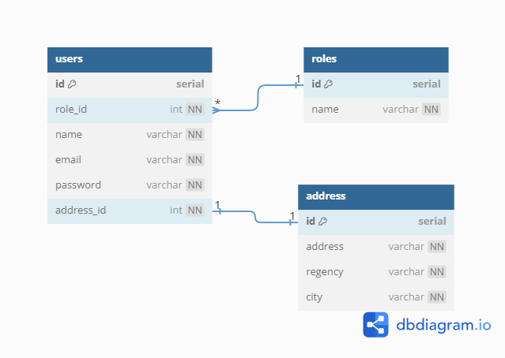
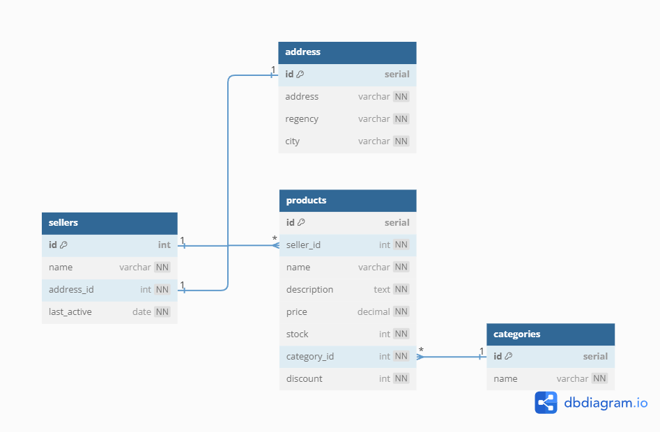

# Kiwish

An e-commerce API with many features, made using microservices and gRPC.

[API Documentation](https://ms-gateway-zx7zn2gpva-as.a.run.app/swagger/index.html)

## Features
- Microservice Architecture
- gRPC-based services
- Serverless Deployment with Google Cloud Run
- Shipment tracking system
- Payment gateway integration (Xendit)

## Tech Stack

- Go
- Echo
- GCP
- Microservices
- gRPC
- REST
- PostgreSQL
- MongoDB
- Redis
- SMTP

#### 3rd Party APIs
- Xendit
- Binderbyte
- RajaOngkir

## Application Structure

## Application Flow

---

## ERD

### Order

### Notifications

### User

### Seller

